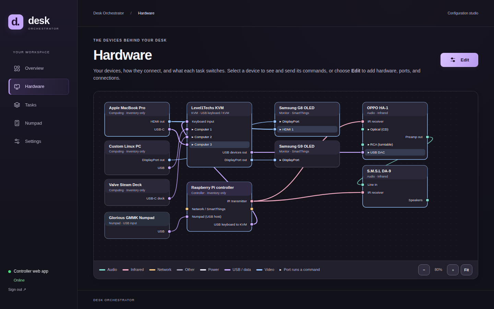
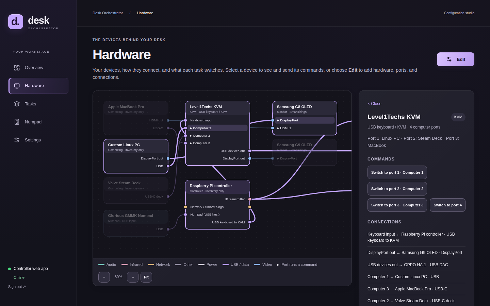
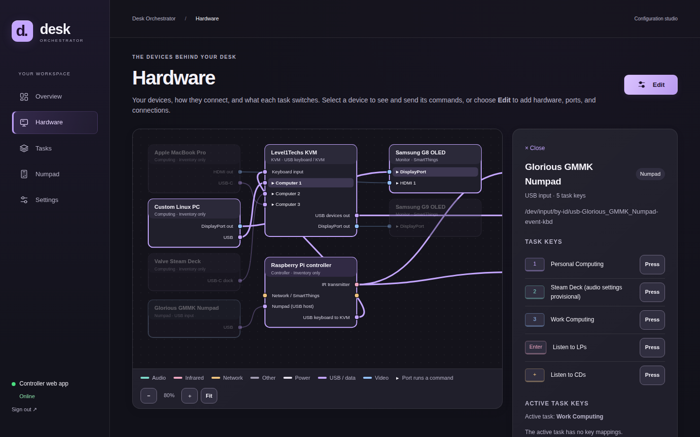
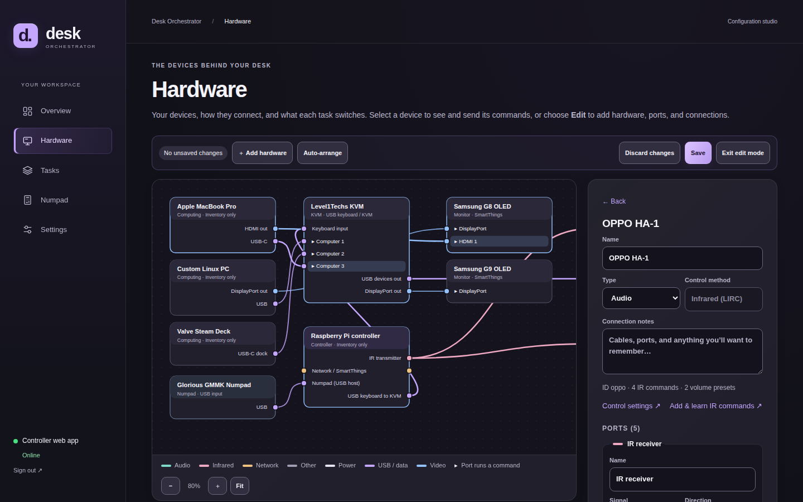
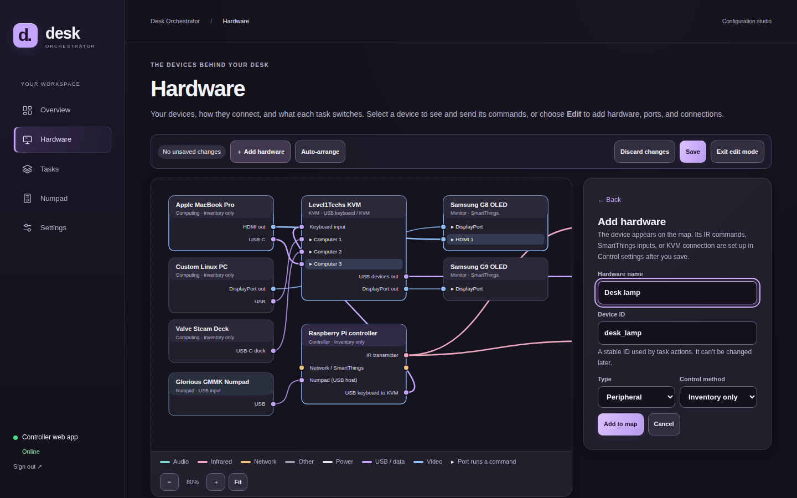
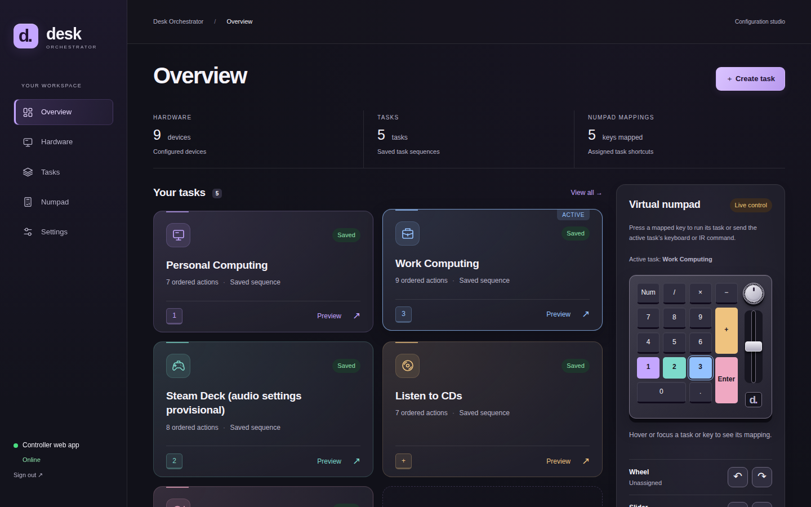
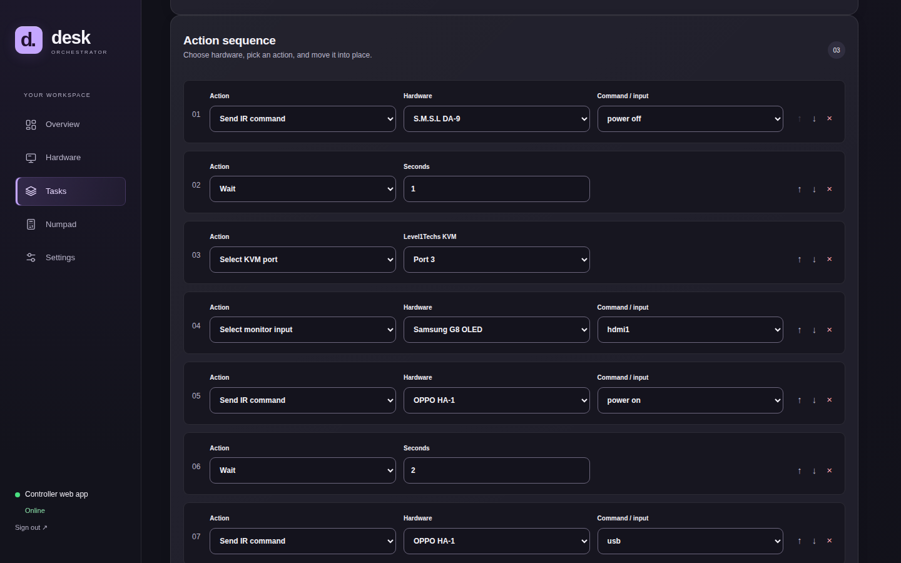
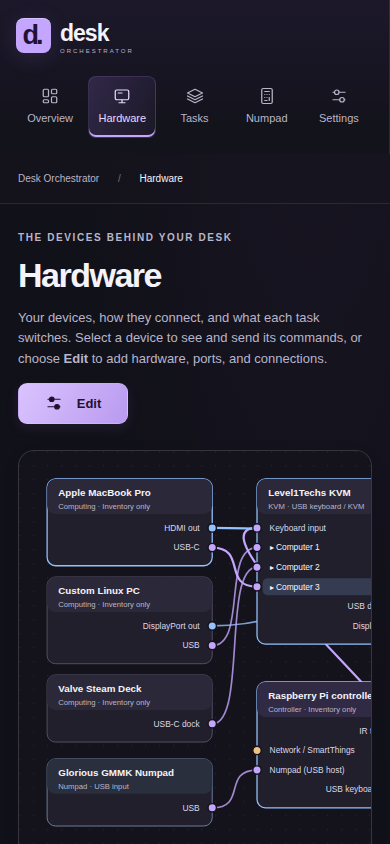

# Desk Orchestrator

A Python 3.11+ controller running on the Raspberry Pi 4. A USB numpad selects
configurable scenes; SmartThings changes monitor inputs, LIRC transmits through
the ANAVI Infrared pHAT, and a USB HID gadget or CH9328 serial bridge sends KVM hotkeys.

For the tested Adafruit bridge, see [CH9328 setup and migration](docs/ch9328.md).
The Hardware editor selects the transport; the Pi updater installs serial access
and the commissioning command saves the stable adapter path.

The **Flask configuration web app** manages hardware, task actions, and physical
USB numpad selection, with previews, connection checks, and backups. It uses
Jinja templates, Waitress, and plain JavaScript, with no Node build or external
frontend assets. See the [web app setup guide](docs/web-app.md) for full setup
and Raspberry Pi deployment instructions.

The automated installation and offline tests send no hardware commands.
Device IDs, IR captures, volume calibration,
and Raspberry Pi deployment must be supplied locally before live operation.



## Screenshots

Screenshots use the [example configuration](config/desk.example.toml) with a
sample wiring map; no real hardware was controlled.

| | |
|---|---|
|  |  |
| **Hardware → device panel.** Select a device to send single commands. Hovering a task highlights the devices, ports, and cables it switches. | **Hardware → numpad.** Once a numpad is selected, it appears on the map with its task keys and the active task's key mappings. |
|  |  |
| **Hardware → Edit.** Arrange devices, add typed ports, and drag between port dots to connect them. | **Hardware → Edit → Add hardware.** New devices go straight onto the map; Save writes everything in one step. |
|  |  |
| **Overview.** Task cards, the active task, and the live virtual numpad. | **Tasks → Edit.** An ordered action sequence: IR commands, waits, KVM ports, and monitor inputs. |

<p align="center"></p>

## Automated Raspberry Pi setup

After copying this project to a Raspberry Pi 4 running Raspberry Pi OS or Ubuntu
with Python 3.11+, run from the project directory:

```bash
sudo bash deploy/setup-pi.sh --reboot
```

The installer installs dependencies, configures ANAVI/LIRC and the USB gadget,
creates the service account and web password, and starts the configuration web
app. It preserves saved configuration on reruns. Device credentials, learned IR
codes, numpad selection, and volume calibration remain commissioning steps;
live control is enabled afterward. See the [automated installation guide](docs/raspberry-pi.md#automated-installation-recommended)
for copying the project, first login, read-only checks, and updates.

Pi setup and updates install the TLS dependencies. HTTPS listening remains
opt-in through `deploy/setup_https.py`, which checks Python dependencies and service-account
access first. Existing HTTPS services are handled during updates and rollback.
See the [SmartThings and HTTPS change inventory](docs/smartthings-changes.md).

## Update an existing Raspberry Pi

Run from this project on your development computer to send the latest changes:

```bash
bash deploy/update-pi.sh pi@192.168.1.50
```

The updater installs the current code and dependencies, checks the developer
console, and restarts previously running services. It preserves saved settings
and keeps the previous installation for rollback. See the
[update guide](docs/updating-pi.md) for access, recovery, and updates from local files.

## Configuration web app

- **Hardware:** a map of your devices, their ports, and the cables between them.
  Select a device to send its commands or run the tasks that use it. **Edit** adds,
  renames, arranges, wires, and deletes hardware there; each device's **Control
  settings** page sets the control method details: add or learn IR commands, test
  individual buttons, configure calibrated volume presets, SmartThings input
  mappings, or USB HID KVM settings. See [Hardware map](#hardware-map).
- **Tasks:** create, edit, and delete tasks; arrange actions in execution order;
  configure delays and assign numpad keys. Duplicate key assignments and deletion
  of hardware referenced by tasks are rejected. Tasks do not require a separate
  settings confirmation or hardware preflight. Saved commands run regardless of
  hardware verification and calibration flags; connection diagnostics are optional.
- **Numpad:** select the physical USB input device, configure exclusive access,
  or enter a device path manually. The page lists currently connected USB devices,
  their input interfaces, vendor/product IDs, stable paths, and access status.
  Refresh the list after plugging or unplugging equipment.
- **Overview:** view task configuration status, numpad mappings, the selected
  input device, and the last execution record.
- **Settings:** configure controller connections and credential references,
  link SmartThings with OAuth, test token refresh, discover device IDs, and
  download or restore configuration backups. See [OAuth setup](docs/smartthings-oauth.md).
- **Previews:** inspect task actions and run read-only connection checks before
  commissioning. Live task execution remains on the numpad or CLI.

USB discovery describes the computer hosting the web app: the Linux desktop
during development, or the Pi after deployment. It reads Linux sysfs without
capturing keystrokes or taking over a keyboard. Selection prefers stable
`/dev/input/by-id/` paths, then `by-path`; `eventN` paths may change after reboot.
A visible device may still need input permissions before the listener can read
it. Saving a selection preserves key mappings; restart the listener after changing
the device or exclusive-access setting.

### Hardware map

The **Hardware** page shows a map of every device as a node with ports, and the
cables between them. Select a device to send its single commands or run the
tasks that use it, with the virtual numpad's lock, duplicate protection, and
no-retry rules. Hovering a task there highlights the devices, ports, and cables
it switches.

**Edit** opens edit mode. **Add hardware** takes a name, ID, type, and control
method and places the device on the map. Select a device to rename it, edit its
type and notes, add ports (name, signal type, direction, and optionally the IR
command, SmartThings input, or KVM port it selects), or delete it. Hardware
used by a task can't be deleted. Drag devices to arrange them, and drag between
port dots to connect them. **Save** writes new hardware, changes, deletions, and
the layout in one revision-checked step. **Exit edit mode** returns to the live
map and asks before discarding unsaved changes. Control method details are set
from the device's **Control settings** link after it is saved.

Each inventory item carries an optional `map` field in `controller.json`, so
there is no second data store, and backups, restore, and stale-tab protection
apply unchanged.
Once a numpad is selected on the Numpad page it appears on the map too; select
it to press its task keys and the active task's key mappings.
A fixed **Raspberry Pi controller** node is added once to existing
configurations; it can be renamed but not deleted. See the
[hardware map guide](docs/web-app.md#hardware-map).

### Rotary dial and slider

Both controls can have different mappings for each task. In **Tasks → Edit →
Dial and slider**, choose **Device volume (relative)**, an IR-controlled device
(such as the HA-1 or DA-9), and its volume-up/down commands. Each control can
target a different device. **Directional IR commands** supports other pairs of
single-command actions. Controls remain unassigned until configured.

For rotary volume, **Wheel click** is the single setup: configure **Source 1 ·
Default**, then use **Add volume source** for any additional devices. Each entry
has its own up/down commands. Use **Move up** and **Move down** to set the order.
Source 1 is active immediately when the task completes; clicks advance to source
2, source 3, and so on, wrapping back to source 1. A single-source list stays on
that source. Running the task again restores source 1. Configure the wheel's click key code and optional
separate input interface on the Numpad page. The virtual wheel uses the same
selection and displays the current source. Clicking only changes the target;
turning the wheel sends volume commands.

In **Numpad → Rotary dial and slider inputs**, choose each control's Linux input
interface and signal type. The number keys and media controls can appear on
different interfaces of the same USB device. The app supports two-key signals,
relative axes, and absolute axes; it also exposes signal codes, direction
reversal, and a movement threshold for slider jitter. Restart the numpad listener
after changing physical input settings.

Glorious documents the knob and slider as volume controls by default, but this
does not establish which events a particular firmware emits on Linux. The USB
inventory shows advertised signals; the bounded `desk input-monitor` command
lets you verify the actual events without sending hardware commands. The stock GMMK Numpad slider uses a separate raw HID report, not its advertised
ABS_VOLUME input. Select **GMMK Numpad slider (raw HID)** for the slider. The
listener discovers USB interface 01 on the selected numpad (320f:5088), opens it
read-only, and decodes position reports while leaving the dial on its existing
volume keys. Setup and updates install the service account’s read-only GMMK
permissions. QMK MIDI slider firmware still needs a different adapter.
See [dial and slider setup](docs/web-app.md#configure-the-rotary-dial-and-slider)
for the setup sequence and source documentation.

Mappings follow the last successfully completed live task, including tasks run
from the CLI using the same configuration/runtime directory. Controls are ignored
while a task runs and after execution failure. The overview displays
the active task and its mapped devices. Configuration edits reload on subsequent
events; physical input changes require restarting the listener.

Volume adjustments are relative IR presses, not exact dB changes or an absolute
slider-to-volume mapping. Each direction needs a verified single-pulse command
with count 1 and a gap no longer than 0.5 seconds. The first absolute reading
after connection or task transition establishes a baseline without changing
volume. Fast motion is rate-limited and never queued; no automatic catch-up or
volume reset occurs. Desktop system volume, SmartThings volume, and MIDI outputs
need additional adapters.

### GMMK Numpad RGB

**Numpad → RGB lighting** configures separate key and side-light colors, solid or
breathing lighting, brightness, and off on the stock USB GMMK Numpad. Save settings
and click **Apply saved lighting**, with the intended onboard profile/layer active.
The adapter sends a lighting-only overlay report and preserves key, dial and
slider settings. Setup and updates provide write access only to its lighting
interface; reconnect the numpad after updating. Physical RGB operation still
needs verification on the numpad. See [RGB research, setup and limitations](docs/gmmk-rgb.md).

### Interface and status colors

Tasks support per-task **Keyboard mapping** for unbound numpad keys. Select a
key in the task editor and choose **Keyboard sequence** or **IR command**.
For a keyboard sequence, enter any supported
key combination. For example, map Num Lock to `Win+R` for a Windows task,
`Cmd+Space` for a macOS task, or `Ctrl+Alt+T` for a Linux task. Use the shortcuts
configured on each computer; the Pi sends the physical keys and does not detect
the operating system or configure the receiving apps.

For **IR command**, select an IR device and one of its saved commands from
Hardware. Each press sends that command through the Pi’s IR transmitter, including
any saved learned-code sequence. IR mappings work without USB keyboard hardware.
The same active-task, reserved-key, repeat, and busy protections apply to both
physical and virtual numpad presses.

Use **Add step** for an ordered sequence of shortcuts and optional delays.
`Ctrl+C → wait 0.25 seconds → Ctrl+V` runs once per numpad press. Steps can be
reordered or removed, and the sequence name is optional. Task previews and the
virtual numpad show the name or sequence. Bindings change with the active task,
after it completes successfully. Existing keyboard presets become editable
shortcuts; old media commands remain visible for explicit replacement or removal.

Shortcuts support letters, digits, punctuation, navigation, numpad keys, F1–F24,
left/right modifiers, and advanced Keyboard/Keypad usage codes `0x04`–`0xDF`.
Use `Shift+Equal` for `+`. Shortcuts send physical keys interpreted using the
connected computer's layout; uppercase letters alone do not imply Shift. Up to
six non-modifier keys can be held together. Macros allow 1–100 steps with at most
60 seconds of explicit delays. Each step releases its keys. USB interfaces are
opened when used, and a failed step stops the macro.
The controller remains busy for the whole sequence and does not queue input.

In gadget mode, F13–F24 and advanced keys above `0x65` require the updated descriptor;
restart the gadget service after updating the application (see the USB setup
instructions below). Standard shortcuts within the original keyboard range work
with the existing interface. Hardware-only keys such as Fn are not USB keyboard
usages and cannot be synthesized as named shortcuts.

Task-launch and dial/slider input keys are reserved. Each press sends one command;
releases, held-key repeats, busy inputs, and stale virtual presses are ignored or
rejected. Keyboard commands go to the currently connected USB/KVM computer; IR commands
go to the mapped device through the Pi’s IR transmitter.

With the CH9328 serial bridge, shortcuts such as `Win+R` and keyboard-only macros
use one serial session. Saved legacy media presets still mean USB HID Consumer
Control commands; they are never automatically translated into shortcuts. The CH9328 Mode 3
transport cannot send Consumer Control; a media-capable bridge or the Pi gadget
is required. A macro containing media commands is rejected before any keys are
sent. See [keyboard and media capabilities](docs/ch9328.md#commands-and-limitations).

In gadget mode, media commands require the additional Consumer Control interface
(`/dev/hidg1` by default); ordinary keyboard commands use `/dev/hidg0`. The KVM
hardware editor exposes both paths. Existing Pi installations need the updated
gadget script and udev rule, then a gadget restart as described in
[USB keyboard gadget setup](docs/raspberry-pi.md#usb-keyboard-gadget). The KVM and
host must pass through and support Consumer Control reports; verify playback on
the connected computer. Usage IDs follow the
[USB-IF HID Usage Tables](https://www.usb.org/sites/default/files/hut1_3_0.pdf).

The Overview includes a **live virtual numpad**. Click a mapped key to run its
saved task on the hosting controller, just like the physical numpad. The wheel
and slider operate the active task's directional IR mappings. They honor the
shared execution lock and direction reversal. Busy inputs
are ignored, and lost requests are never retried automatically. The slider is a
relative gesture control, not an absolute volume display. See
[virtual numpad behavior](docs/web-app.md#included) for details.

The interface uses plain page names and functional instructions, without
promotional headings or taglines. Its dark theme combines neutral charcoal
panels, bright text, and visible control borders. Purple highlights navigation,
primary actions, and mapped numpad keys. Status colors retain their usual meaning:
green for success/online, red for errors/disconnection, amber for warnings or
unknown state, and blue for informational notices. Status text accompanies color.

Choose a task color and icon under **Task details** when creating or editing a
task. The five colors and twelve icons use visual pickers; icon previews update
to the selected color. Choices are saved with the task and included in backups.
Task cards and mapped numpad keys use the saved appearance. Older tasks keep
their original appearance until edited.

The sidebar's **Controller web app** indicator checks the authenticated `/health`
endpoint immediately and every ten seconds after a check completes, with a
four-second request timeout. It shows green **Online** when reachable, red
**Disconnected** or **Unavailable** when checks fail, and amber when the session
expires or status is unknown. It recovers automatically when connectivity returns.
This measures web-app availability; it does **not** measure Raspberry Pi power,
the numpad listener, or the physical state of connected equipment.

### Run the web app locally

From the project directory, install the optional dependencies into a virtual
environment. Skip password initialization if this data directory is already set up:

```bash
python3 -m venv .venv
.venv/bin/pip install -e '.[web,keypad]'
.venv/bin/desk web-password --data-dir .runtime/web
```

For a persistent local server, use the provided user service:

```bash
systemctl --user enable --now "$PWD/deploy/desk-web-local.service"
systemctl --user status desk-web-local.service
```

Open [the local web app](http://127.0.0.1:8080/). The service runs independently
of the terminal, starts at user login, and restarts after failure. It assumes the
checkout is at `~/Documents/Code/desk-orchestrator`; adjust the paths in
`deploy/desk-web-local.service` for a different location. It preserves the saved
configuration and authentication in `.runtime/web`.

```bash
systemctl --user restart desk-web-local.service
journalctl --user -u desk-web-local.service -n 50
systemctl --user disable --now desk-web-local.service
```

Restart after Python or template changes. The final command stops the service
and disables startup at login. For temporary foreground operation instead:

```bash
.venv/bin/desk web --data-dir .runtime/web --host 127.0.0.1 --port 8080
```

Run only one server on port 8080. A foreground server stops when its terminal or
execution session ends; the user service avoids that cause of connection-refused
errors. The Pi uses the separate [system service](deploy/desk-web.service), with
installation and SSH-tunnel access covered in the [web app guide](docs/web-app.md).

### Saved configuration and authentication

The first web startup imports the seed configuration into
`.runtime/web/controller.json`. Subsequent edits are saved there; the seed is not
overwritten. Point the CLI and numpad listener at the same managed file:

```bash
.venv/bin/desk -c .runtime/web/controller.json plan work
.venv/bin/desk -c .runtime/web/controller.json listen
```

The listener reloads hardware controls, tasks, and key mappings before each new
key press. A running task retains its original configuration. Device-path and
exclusive-access changes require a listener restart. On the Pi, use the provided
[managed-configuration drop-in](deploy/web-managed-controller.conf).

The web app requires a password and uses CSRF protection, host validation, atomic
saves, and revision checks to prevent stale tabs from overwriting newer edits.
There is no default password. Backups include hardware, tasks, key mappings, and
connection references, but not secret token values or learned LIRC waveforms.
Restore preserves the host's local connection settings and numpad selection.
See the [web app guide](docs/web-app.md) for password management and backup details.

## Your desk modes

| Numpad | Mode | KVM / G9 | Direct-connected G8 | HA-1 input | Volume target | DA-9 |
|---|---|---|---|---|---|---|
| 1 | Personal | Port 1: Linux PC | DisplayPort | USB | −32.0 dB | On |
| 2 | Steam Deck | Port 2 | Unchanged | USB, provisional | −32.0 dB, provisional | On, provisional |
| 3 | Work | Port 3: MacBook | HDMI 1 | USB | −32.0 dB | On |
| Enter | LPs | Unchanged | Unchanged | RCA | +6.0 dB | On |
| + | CDs | Unchanged | Unchanged | Optical | −32.0 dB | On |

Work, LP, and monitor wiring incorporate your clarifications. The G9 stays on its
DisplayPort connection to the KVM. Only the Steam Deck KVM port is confirmed;
confirm or edit its proposed audio settings in the config. Personal mode assumes
the HA-1 is already powered, matching your request; the other audio modes request
HA-1 power-on. Speaker amplification is disabled during changes and enabled last.
Verify the HA-1 preamp-to-DA-9 connection, DA-9 input/gain, and the turntable's
phono stage during commissioning; those details were not provided.

## Try it on this Linux PC

The core uses only the Python standard library. From this directory:

```bash
python3 -m desk_orchestrator list
python3 -m desk_orchestrator plan work
python3 -m desk_orchestrator run lps
cp config/desk.example.toml config/desk.toml
```

`plan` and `run` without `--live` do not access hardware, contact SmartThings,
read credentials, or write execution state. They show the intended sequence and
remaining configuration gaps. The runtime directory is relative to the TOML
file; use absolute paths for device nodes, sockets, and the optional token file.

The core controller uses only the standard library; importing the CLI does not
require Flask. The full test suite requires the optional dependencies described
under Verification below.

For an installed CLI and physical numpad support:

```bash
python3 -m venv .venv
.venv/bin/pip install '.[keypad]'
.venv/bin/desk -c config/desk.toml input-devices
.venv/bin/desk -c config/desk.toml check
.venv/bin/desk -c config/desk.toml check work --probe
.venv/bin/desk -c config/desk.toml listen
```

`check --probe` reads SmartThings status, checks gadget access, and queries LIRC
code availability. It sends no device control commands, though OAuth may refresh.
Once commissioned, `run work --live` runs once and `listen --live` enables the
five physical key mappings. The daemon uses exactly the same runner as the CLI.

## Physical control limits

**Exact HA-1 volume is not available from blind IR.** OPPO documents a motorized
analog potentiometer and approximate dB readout. This project does not assume a
fixed dB increment or remember an unreliable volume counter. Volume steps execute
the saved preset sequence without requiring calibration or approximation flags. An exact target
requires a feedback controller, for example a camera reading the display; that
hardware and controller are not included. See [volume commissioning](docs/commissioning.md#volume).

**Power-on is different from power-toggle.** The example's `KEY_POWER_ON` and
`KEY_POWER_OFF` names are placeholders, not evidence that these devices support
discrete codes. Verify actual codes. If the DA-9 only exposes a toggle, reliable
unattended on/off needs power-state feedback or another control path. Do not label
a toggle as a discrete command; software cannot infer physical state across
manual remote use, power loss, or missed IR. Execution does not require verified
or discrete flags. A supervised alternative is to remove the amp power steps and
manage it manually, accepting that this no longer fully automates the scene.

**The KVM needs a physical USB keyboard connection.** With CH9328, a Pi USB-A
port drives the USB-to-TTL adapter and the bridge's USB-C cable connects to the
KVM HID port. The Pi keeps its normal power supply. See [CH9328 setup](docs/ch9328.md).
For the original gadget transport, the numpad plugs into a
Pi USB-A host port; the Pi USB-C device port connects to the KVM's keyboard/HID
port. The Pi needs a suitable independent power arrangement. See the
[Pi setup guide](docs/raspberry-pi.md); do not assume a normal USB-C hub provides
the necessary power/data topology. The Pi transmits two left-Ctrl taps followed by
a top-row digit, even though the trigger was a numpad key.

## Behavior and reliability

- Tasks, controls, and keyboard commands run without hardware preflight checks.
  An execution error stops the scene immediately; later steps are skipped.
  Manual connection diagnostics and CLI `check` remain available.
- CLI and numpad runs share a filesystem lock. Busy requests are rejected, not
  queued. Key repeats and presses during execution are discarded.
- IR macros use finite single presses; no indefinitely repeating IR command.
- SmartThings commands require input status confirmation; HTTP acceptance alone
  is insufficient. Cloud outages stop monitor scenes. CD/LP scenes do not need
  SmartThings credentials or network access.
- Use the web overview or `desk status` to inspect the last execution record.
  `commands_sent` is deliberately not a claim of verified IR or KVM state. A stale
  `running` record after sudden power loss is also unknown. The web connection
  indicator is separate from this execution record and from hardware telemetry.
- No automatic rollback: physical actions may already have occurred. Resolve
  failures with the display/remote, then rerun the scene once the cause is fixed.
- Shutdown allows an in-flight worker to finish where possible. Forced process
  termination or power loss can interrupt a scene. Discrete off/on and feedback
  are not substitutes for an audio mute interlock; a missed IR off can go unseen.

## Verification

With the `web,keypad,tls,serial` optional extras installed, run:

```bash
.venv/bin/python -m unittest discover -s tests -v
```

Tests cover the runner and adapters using fake hardware, configuration persistence,
hardware/task editing, authentication and CSRF, backup/restore, USB discovery and
selection, and authenticated web health checks. The updated dashboard and task
editor have also been checked in the browser. Primary text/status color pairs
were checked for at least 4.5:1 contrast; connection-indicator checks covered
online, disconnected, expired-session, and recovery states. These checks do not
replace commissioning against the physical hardware.

## Files and next steps

- [Example configuration](config/desk.example.toml): scenes, mappings, device IDs,
  and learned IR command names.
- [Commissioning](docs/commissioning.md): SmartThings discovery/authentication,
  IR learning, volume, and component-by-component acceptance checks.
- [Raspberry Pi installation](docs/raspberry-pi.md): ANAVI overlays, gadget setup,
  permissions, and systemd deployment.
- [Web app setup](docs/web-app.md): local and Pi deployment, USB numpad selection,
  authentication, backups, and IR learning, and remaining calibration features.
- [Local web service](deploy/desk-web-local.service): persistent desktop preview.
- `desk_orchestrator/`: runner, hardware adapters, SmartThings client, input loop,
  Flask app, configuration store, USB discovery, templates, and theme assets.
- `tests/`: offline behavioral tests using fake hardware and mocked API requests.

Primary references: [OPPO volume behavior](https://www.oppodigital.com/KnowledgeBase.aspx?KBID=91&ProdID=HA-1),
[Level1Techs KVM guide](https://forum.level1techs.com/t/official-l1techs-kvm-faq-ultimate-guide-help/186196),
[ANAVI guide](https://github.com/AnaviTechnology/anavi-docs/blob/main/anavi-infrared-phat/anavi-infrared-phat.md),
[Linux HID gadgets](https://docs.kernel.org/usb/gadget_hid.html),
[SmartThings command API](https://developer.smartthings.com/docs/service-integrations/control-devices).

For built-in HTTPS and manual Lightsail TXT verification, see [HTTPS setup](docs/https-lightsail.md).
